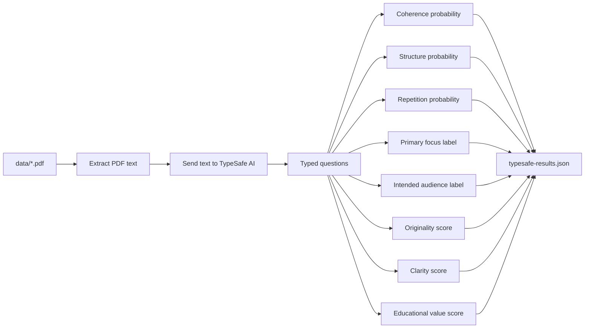
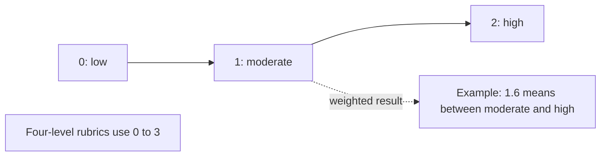

# TypeSafe AI PDF test

This console app extracts text from the PDFs in `data/` and sends each selected document to TypeSafe AI with 8 typed questions:

- Is the document thematically coherent?
- Is the document well structured?
- Does it contain repeated content?
- What is its primary analytical focus?
- Who is the intended audience?
- How original does the commentary appear?
- How clear is the explanation?
- What is its educational value?

The Harry Potter-themed PDFs in `data/` are synthetic test data for evaluating the TypeSafe AI workflow. They contain original thematic commentary and summaries, not complete copyrighted books or copied book text.


## Run

Set the API key in the current PowerShell session:

```powershell
$env:TYPESAFE_API_KEY = "your-key"
```

Run a five-document smoke test:

```powershell
dotnet run --project .\TypeSafeJev.csproj
```

Run every PDF in `data/`:

```powershell
dotnet run --project .\TypeSafeJev.csproj -- --all
```

Use a custom number of documents with `--limit`, for example `--limit 10`. Results are written to `typesafe-results.json`.

## Processing flow



## Score rubric

